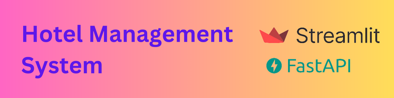

# Hotel Management System

A modern web application for managing hotel operations, including handling customers, rooms, and bookings. This project utilizes **Streamlit** for a user-friendly interface and **FastAPI** for robust backend services.

## Features

- **Customer Management**: View, add, update, and delete customer records.
- **Room Management**: Manage room details such as number, size, and pricing.
- **Booking Management**: Facilitate the booking process and maintain reservation records.

## Technology Stack

- **Backend**: FastAPI
- **Frontend**: Streamlit
- **Database**: SQLite
- **ORM**: SQLAlchemy

## Getting Started

These instructions will get you a copy of the project up and running on your local machine for development and testing purposes.

### Prerequisites

Before running the project, make sure you have the following installed:

- Python 3.11+
- pip

### Installation

1. Clone the repository:
```bash
git clone https://github.com/hosseinabadii/Hotel-Management-System.git
cd Hotel-Management-System
```

2. Install the required dependencies:
```bash
pip install -r requirements.txt
```

### Running the Application

1. For development use, rename `env_dev.txt` to `.env`:

```bash
mv env_dev.txt .env
```
> **Tip:** For deployment use rename `env.txt` to `.env`
> ```bash
> mv env.txt .env
> ```

2. Start the FastAPI server:

(Development mode)
```bash
fastapi dev backend/server.py
```

(Production mode)
```bash
fastapi run backend/server.py
```

3. In a new terminal, launch the Streamlit frontend:
```bash
streamlit run frontend/app.py
```

4. Open your web browser and go to `http://localhost:8501` for the Streamlit app and `http://localhost:8000` for the FastAPI documentation.

## Usage

Explain how to use the system, including creating, viewing, updating, and deleting records for customers, rooms, and bookings.

## License

This project is licensed under the [MIT License](./LICENSE).
