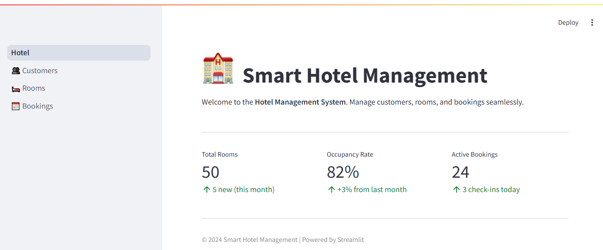
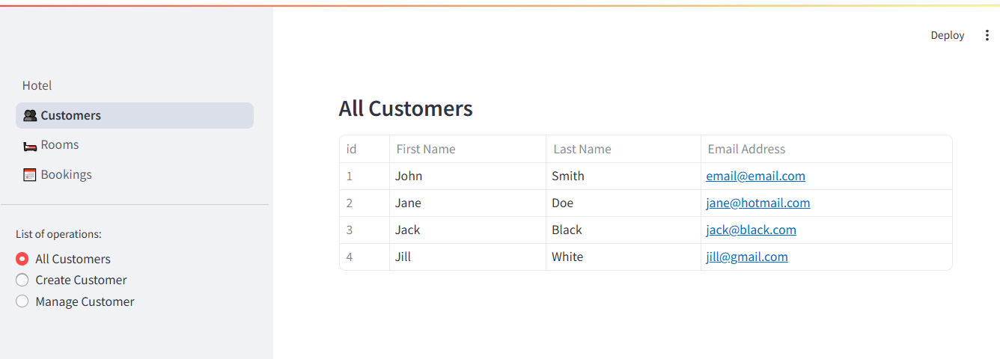

# 🏨 Hotel Management Dashboard


A modern and efficient hotel management system built with [**FastAPI**](https://fastapi.tiangolo.com/) and [**Streamlit**](https://streamlit.io/). This application provides a comprehensive solution for managing hotel operations, including customer management, room bookings, and reservation tracking.

## 🚀 Features

- **Customer Management**

  - View all customers in a table format
  - Add new customers with validation
  - Update customer information
  - Delete customer records

- **Room Management**

  - View all rooms with their details
  - Add new rooms with number, size, and price
  - Update room information
  - Delete room records

- **Booking Management**
  - View all bookings with customer and room details
  - Create new bookings with date selection
  - Update booking information
  - Delete booking records

## 💻 Technology Stack

- **Backend**: FastAPI (RESTful API)
- **Frontend**: Streamlit (Interactive Dashboard)
- **Database**: PostgreSQL with asyncpg (with SQLite fallback)
- **ORM**: SQLAlchemy 2.0 (Async)
- **Containerization**: Docker & Docker Compose

## 📋 Prerequisites

Before you begin, ensure you have the following installed:

- **Python 3.12+** – Required for FastAPI and Streamlit features
- **pip** – Python package installer
- **Git** – For version control
- **Docker & Docker Compose** – For containerized deployment

## 📦 Setup

To set up the project, follow these steps:

1. **Clone the repository**

   ```bash
   git clone [repository-url]
   ```

2. **Navigate to the project directory**

   ```bash
   cd [project-directory]
   ```

3. **Create and activate a virtual environment**

   - Windows:

     ```bash
     python -m venv venv
     venv\Scripts\activate
     ```

   - Linux/macOS:

     ```bash
     python3 -m venv venv
     source venv/bin/activate
     ```

### Development Setup

1. **Backend Setup**

   ```bash
   cd backend
   mv env.txt .env
   pip install -r requirements.txt
   fastapi run app
   ```

   - Access API documentation at: `http://localhost:8000/docs`

   (Optional) In a new terminal, run the following command to populate the database with sample data:

   ```bash
   python -m app.db.sample_data
   ```

2. **Frontend Setup**

   ```bash
   cd frontend
   mv env.txt .env
   pip install -r requirements.txt
   streamlit run src/Hotel.py
   ```

   - Access the dashboard at: `http://localhost:8501`

### Docker Deployment

1. **Set up environment variables**

   ```bash
   mv env.txt .env
   ```

2. **Start all services**

   ```bash
   docker compose up
   ```

   This will start:

   - PostgreSQL database (port 5432)
   - FastAPI backend (port 8000)
   - Streamlit frontend (port 8501)

## 📷 Screenshots:




## 📚 API Endpoints

### Customers

- `GET /api/v1/customers/` - List all customers
- `POST /api/v1/customers/` - Create new customer
- `GET /api/v1/customers/{customer_id}` - Get customer details
- `PUT /api/v1/customers/{customer_id}` - Update customer
- `DELETE /api/v1/customers/{customer_id}` - Delete customer

### Rooms

- `GET /api/v1/rooms/` - List all rooms
- `POST /api/v1/rooms/` - Add new room
- `GET /api/v1/rooms/{room_id}` - Get room details
- `PUT /api/v1/rooms/{room_id}` - Update room
- `DELETE /api/v1/rooms/{room_id}` - Delete room

### Bookings

- `GET /api/v1/bookings/` - List all bookings
- `POST /api/v1/bookings/` - Create new booking
- `GET /api/v1/bookings/{booking_id}` - Get booking details
- `PUT /api/v1/bookings/{booking_id}` - Update booking
- `DELETE /api/v1/bookings/{booking_id}` - Delete booking

## 🔧 Environment Variables

Required environment variables in `.env` file:

### Database Configuration

- `POSTGRES_USER`: PostgreSQL username
- `POSTGRES_PASSWORD`: PostgreSQL password
- `POSTGRES_DB`: PostgreSQL database name
- `DATABASE_URL`: Database connection URL (PostgreSQL or SQLite)

### Application Configuration

- `BASE_URL`: Backend API URL for frontend communication

## 📊 Dashboard Features

The Streamlit dashboard provides an intuitive interface for:

1. **Customer Management**

   - View all customers in a table
   - Create new customer records
   - Update customer information
   - Delete customer records

2. **Room Management**

   - View all rooms with details
   - Add new rooms with validation
   - Update room information
   - Delete room records

3. **Booking Management**
   - View all bookings
   - Create new bookings with date selection
   - Update booking details
   - Delete booking records


## 📝 License

This project is licensed under the [MIT License](./LICENSE).
